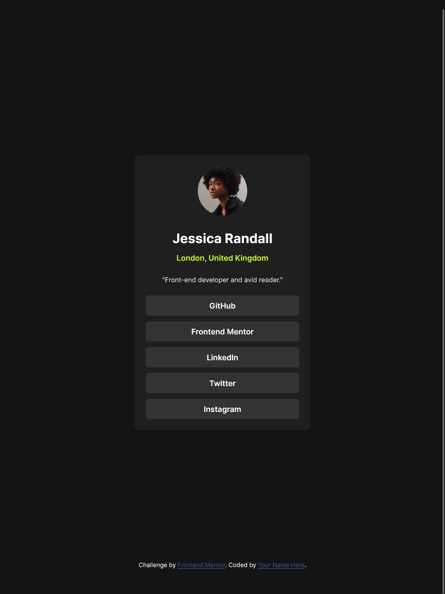

# Frontend Mentor - Social links profile solution

This is a solution to the [Social links profile challenge on Frontend Mentor](https://www.frontendmentor.io/challenges/social-links-profile-UG32l9m6dQ). Frontend Mentor challenges help you improve your coding skills by building realistic projects.

## Table of contents

- [Overview](#overview)
  - [The challenge](#the-challenge)
  - [Screenshot](#screenshot)
  - [Links](#links)
- [My process](#my-process)
  - [Built with](#built-with)
  - [What I learned](#what-i-learned)
  - [Continued development](#continued-development)
- [Author](#author)

## Overview

### The challenge

Users should be able to:

- See hover and focus states for all interactive elements on the page

### Screenshot



### Links

- Live Site URL: [social links profile](https://social-links-profile-main3013.netlify.app/)

## My process

### Built with

- Semantic HTML5 markup
- CSS custom properties
- Flexbox
- Mobile-first workflow

### What I learned

how to add footer to the bottom of the page

To see how you can add code snippets, see below:

```html
<footer>
  <div class="attribution">
    Challenge by
    <a href="https://www.frontendmentor.io?ref=challenge" target="_blank"
      >Frontend Mentor</a
    >. Coded by <a href="#">Your Name Here</a>.
  </div>
</footer>
```

```css
@media (min-height: 45em) {
  footer {
    position: absolute;
    bottom: 20px;
  }
}
```

### Continued development

Better ways to write clean code, place the footer to the bottom of the page and make my design more perfect.

## Author

- Frontend Mentor - [@flashdaniel](https://www.frontendmentor.io/profile/Flashdaniel)
- Linkedin - [@Nweze Daniel](https://www.twitter.com/yourusername)
